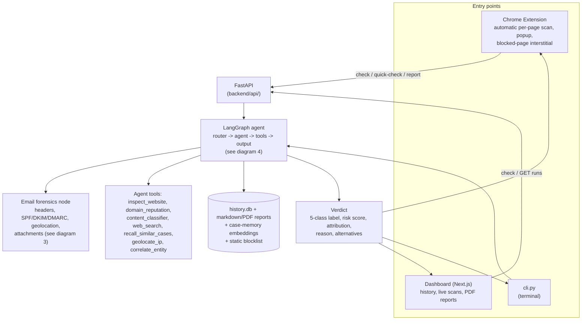
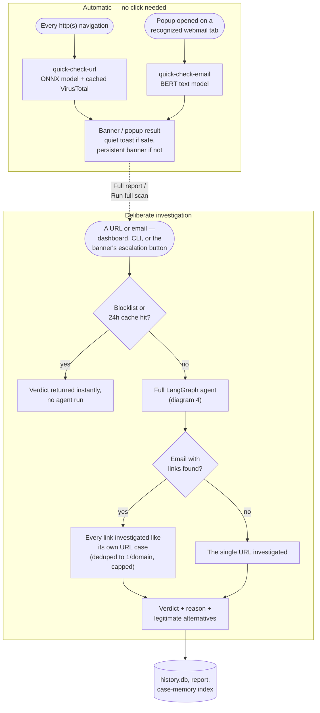
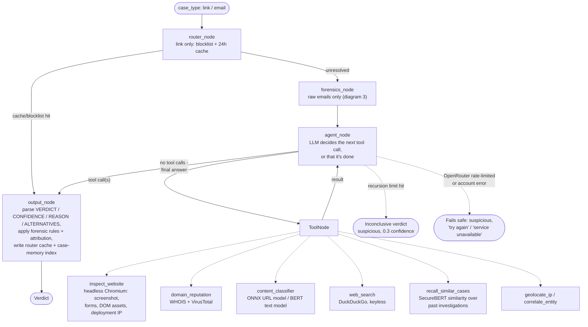

# security-copilot

A personal security assistant with three ways in — a Chrome extension, a web dashboard, and a terminal — all
backed by one [LangGraph](https://github.com/langchain-ai/langgraph) agent. Paste a URL, paste an email, or just
browse normally: a fast local model gives an instant read on everything you visit, and on request the full agent
investigates properly — a real headless-browser sandbox, WHOIS/VirusTotal, DOM and hosting fingerprinting, a
memory of past investigations, and a web search to find the real site if brand impersonation is suspected — then
returns a plain-English verdict in the five SIH26106 classes — **legitimate / suspicious / impersonated /
phishing / fraud-related** — with a risk score, a reason, an attribution category, and (when relevant) links to
the legitimate site it thinks you meant to visit. For a raw email (.eml / full headers) it also runs header
forensics: the Received trace path, SPF/DKIM/DMARC, origin-IP geolocation with VPN/TOR/hosting correlation,
static attachment analysis, and correlation with past cases into campaigns.

This is a from-scratch POC, not a production product — see [Status](#status) for what's real vs. in progress.

## What it does

- **Two-tier detection.** Every page you navigate to (and every email you open, from the popup) gets an instant,
  local, no-LLM read first — an ONNX URL model, a BERT text model, a cached VirusTotal lookup. Only when that's
  ambiguous, or you ask for it, does the full agent run. You get instant feedback on everything, and a real
  investigation on demand.
- **Investigates, it doesn't just classify.** The agent decides for itself which tools to call and how deep to
  go — a page that looks fine after one look gets a quick "safe"; a page with a login form on an unfamiliar
  domain gets a screenshot, a WHOIS/VirusTotal check, a DOM/hosting fingerprint, a model score, and sometimes a
  second look at a suspicious link found on the page, before it answers.
- **Reads whole emails, not just their wording.** Every link found in a pasted or opened email gets the exact
  same investigation a standalone URL would — deduplicated to one per domain, capped so it stays bounded. An
  email's own language and its links are treated as two separate signals; either one alone can be enough to call
  the whole email dangerous.
- **Fingerprints the page, not just the URL.** Beyond content, the sandbox checks whether a page's images,
  scripts, and stylesheets are hotlinked from a different (often the real) domain — a common tell for a cloned
  phishing kit — and captures the page's real HTTP response headers and resolved server IP.
- **Remembers.** Every fresh investigation is embedded and added to a similarity index, so a brand-new domain
  using a trick structurally identical to something seen before (a familiar brand-impersonation pattern, hosting
  shape, or evasion trick) can be recognized even when nothing about the literal URL matches anything on a
  blocklist yet.
- **Catches brand impersonation.** If a domain embeds a well-known brand name in a way that isn't that brand's
  real site (`wmw-google-com.loca.lt`), the agent searches for the real company and surfaces its actual site(s)
  alongside the verdict.
- **Reports outward instead of attacking back.** A confirmed-dangerous URL can be reported with one click:
  added to this tool's own blocklist (enforced immediately, including blocking the tab's navigation with an
  interstitial page) and submitted to VirusTotal with a malicious vote — the legal, effective alternative to
  "hacking back."
- **Explains itself, never leaks internals.** Every verdict is a few plain sentences citing what the tools
  actually showed — never a tool or vendor name, just what was actually found.
- **Every check is recorded.** A local SQLite history + a per-case markdown report (screenshot, redirect chain,
  every tool call) + a polished PDF export from the dashboard — all browsable from the dashboard or `GET /runs`.
- **Email header forensics (SIH26106).** A raw email is parsed with the stdlib `email` package: the Received
  chain is walked oldest-first to find the originating server ("hop-0"), with out-of-order hops and
  From/Return-Path/Reply-To mismatches flagged; SPF/DKIM/DMARC are checked (`checkdmarc`, `dkimpy`); the origin
  IP is geolocated (MaxMind GeoLite2 offline, ip-api.com fallback) and checked against the Tor exit list, VPN and
  datacenter ranges, and AbuseIPDB; attachments are hashed and statically inspected (real type vs. extension,
  Office macros, optional ClamAV) — never opened. Hard authentication failures raise the risk score and feed a
  rule-based attribution (`spoofed_domain`, `compromised_account`, `anonymized_infrastructure`, `direct_actor`).
- **Correlates cases into campaigns.** Domains, IPs and sender addresses from every case form a NetworkX graph
  ("seen together in a case"); similar malicious cases are clustered (DBSCAN over the case-memory embeddings)
  into campaigns.
- **Privacy by default.** PII in stored email bodies is masked with Microsoft Presidio (headers are kept as
  evidence), and runs are deleted after `RETENTION_DAYS`.

## Architecture

Four views of the same system, from the outside in: the whole thing, how a phishing check actually gets decided,
what the email-forensics stage adds, and what the agent itself does internally.

### 1. Complete architecture



### 2. Phishing detection flow

The two-tier strategy in full: what happens automatically with no click, and what happens when you (or the
automatic scan) decides a real investigation is worth it.



### 3. Email forensics

```mermaid
flowchart LR
    EML(["Raw email (.eml)"]) --> HDR["analyze_email_headers\nReceived chain, hop-0 origin,\nsender mismatches"]
    HDR --> AUTH["validate_email_auth\nSPF / DKIM / DMARC + alignment"]
    AUTH --> REP["domain_reputation\nsender-domain age, MX/TXT"]
    REP --> GEO["geolocate_ip\nlocation, ISP, TOR / VPN / hosting,\nAbuseIPDB"]
    GEO --> ATT["scan_attachments\nhash, real type, macros, ClamAV"]
    ATT --> AGENT["Agent reasons over findings\n+ body + links"]
    AGENT --> RULES["verdict_rules.py\nrisk score, escalation,\nattribution"]
    RULES --> OUT(["Verdict + campaign\n(correlation_graph.py)"])
```



### 4. LangGraph agent flow



Full breakdown of every backend file: [backend/README.md](backend/README.md).

## Quick start

**1. Install** (one-time):

```bash
git clone https://github.com/VatsalMehta-0523/sentinelai-cyber-security.git
cd sentinelai-cyber-security
./download_everything.bash    # venv, Python deps, Playwright's Chromium,
                               # warms the ML model cache, extension npm install + build
```

**2. Add your key** — edit `backend/.env`, set `OPENROUTER_API_KEY` (see below):

```bash
$EDITOR backend/.env
```

**3. Run everything:**

```bash
./start_all.bash               # backend + dashboard
```

Open **http://localhost:3000/** for the dashboard (history, reports, live scans), or use the CLI:

```bash
source .venv/bin/activate && cd backend
python cli.py link https://example.com
python cli.py email    # paste text, then Ctrl-D
```

**API keys:**
- `OPENROUTER_API_KEY` — required, the agent's LLM (via OpenRouter, an OpenAI-compatible gateway to many
  models). Get a key at https://openrouter.ai/keys. The default model is `openai/gpt-oss-120b` — reliable at
  tool calling (which the agent needs). Change `OPENROUTER_MODEL` to any tool-calling model at
  https://openrouter.ai/models. If OpenRouter rate-limits the key (429) or rejects it at the account level (402
  out of credits, 401/403 invalid key), the case fails safe to a low-confidence "suspicious, unresolved" verdict
  instead of crashing.
- `ABUSEIPDB_API_KEY` — optional, origin-IP abuse score. Free tier: https://www.abuseipdb.com/register
- MaxMind GeoLite2 — optional: put `GeoLite2-City.mmdb` and `GeoLite2-ASN.mmdb` in `backend/data/intel/`
  (free account at https://www.maxmind.com/en/geolite2/signup). Without them, geolocation uses ip-api.com.
- `VT_API_KEY` — optional, VirusTotal lookups in `domain_reputation` and the "Report & block" action. Degrades
  gracefully if unset. Free: https://www.virustotal.com/gui/join-us

### Manual setup (if you'd rather not run the scripts)

```bash
python3 -m venv .venv && source .venv/bin/activate   # venv lives at the repo root
pip install torch --index-url https://download.pytorch.org/whl/cpu   # or the cu128 index for a CUDA GPU
pip install -r backend/requirements.txt
playwright install chromium
python -m spacy download en_core_web_sm   # PII masking model
cd backend && cp .env.example .env   # then fill in OPENROUTER_API_KEY
uvicorn api.app:app --reload --port 8010

# In another terminal, the dashboard:
cd dashboard && pnpm install
NEXT_PUBLIC_API_BASE_URL=http://localhost:8010 pnpm dev
```

### Startup scripts, at a glance

| Script | What it does |
|---|---|
| `download_everything.bash` | One-time setup: repo-root venv, Python deps, Chromium, ML model cache, extension build. |
| `start_all.bash` | Starts the backend + dashboard. |

Both expect the venv at `.venv/` in the repo root (not inside `backend/`) — that's what `download_everything.bash` creates.

## Load the Chrome extension

1. Make sure the backend is running first (`./start_all.bash`, or the manual steps above).
2. `cd extension && npm install && npm run build` (already done for you by `download_everything.bash`).
3. Open `chrome://extensions`, enable **Developer mode** (top right).
4. Click **Load unpacked**, select `extension/dist/`.
5. Browse normally — every `http(s)://` navigation gets an automatic, instant, local check (no LLM call): a
   quiet toast if it looks fine, a persistent in-page banner if it doesn't, with a **Full report** button to
   trigger a real investigation.
6. Click the security-copilot icon in the toolbar for the popup:
   - **Check this URL** — a full investigation of the current page's URL.
   - **Check page text** — grabs the visible page text and every real link on the page and checks them (works
     on any webapp).
   - On a recognized webmail tab (Gmail, Outlook web, Yahoo Mail, Proton Mail), the popup automatically runs a
     quick phishing read on the open email the moment it's opened, with a **Run full scan** button that
     investigates the email's language *and* every link in it.
7. On a confirmed-dangerous verdict, **Report & block** adds the domain to this tool's own blocklist (future
   navigations to it are redirected to a warning page instead of loading) and reports it to VirusTotal.

If your backend isn't on `http://127.0.0.1:8010`, change it in the extension's Settings (gear icon in the
popup). Extension-specific details: [extension/README.md](extension/README.md).

## Dashboard

A Next.js app (`dashboard/`) separate from the backend — history, live scans, and full run detail pages, with a
"Report & block" action and a one-click, client-generated PDF report (verdict, findings, screenshot, VirusTotal
breakdown) in place of a raw markdown download. Light and dark themes persist across navigation. Every run's
detail page shows exactly what the agent found: the sandboxed screenshot, forms and where they submit to, DOM
asset-hotlinking and hosting signals, the VirusTotal breakdown, and any similar past investigations the
case-memory index recalled.

## Email forensics

Upload a `.eml` (or paste the full raw message) in the dashboard's **Email scans** view, or
`POST /check-email` with the raw text. The run page then shows SPF/DKIM/DMARC results, the origin IP on a map
with TOR/VPN/hosting flags, the Received trace path with anomalous hops flagged, attachment findings, the
attribution category, a graph of the case's connections to past cases, and its campaign (if clustered). The
**Campaigns** view lists every cluster. The PDF report includes all of these fields.

Threat-intel data lives in `backend/data/intel/`: X4BNet's VPN and datacenter CIDR lists are vendored (refresh by
hand — see the header of each file); the Tor exit list is downloaded and cached automatically.

Tests: `cd backend && python -m pytest` (offline; external lookups are stubbed).

## Repository layout

```
backend/        FastAPI + LangGraph agent, email-forensics tools (tools/), case-memory (memory/). Flat, one file per concern — see backend/README.md for the full tree.
dashboard/      Next.js dashboard (history, live scans, run detail pages, PDF export). Talks to the backend
                over the same API the extension uses.
extension/      Chrome MV3 extension: automatic per-navigation quick scan, popup, in-page banner, and a
                blocked-page interstitial for reported/blocklisted domains.
download_everything.bash   One-time setup: venv, deps, Playwright, ML model cache, extension build.
start_all.bash             Starts the backend + dashboard (port-safe — refuses to clobber something already listening).
```

## Status

**Real and tested end-to-end:** the agent (all 5 tools), the router's blocklist/cache fast path, the CLI, the
FastAPI backend, the Next.js dashboard (history, filters, run detail pages, PDF export, theme persistence), run
history + markdown/PDF reports, DOM asset-hotlinking + deployment fingerprinting, the case-memory recall index,
"Report & block" (blocklist enforcement + VirusTotal submission), and the Chrome extension's automatic
per-navigation quick scan + popup + blocked-page interstitial — all verified against live services (OpenRouter,
VirusTotal, WHOIS, DuckDuckGo, real phishing test sites) and, for the extension, loaded into real Chrome.

**Email forensics (SIH26106):** header analysis, SPF/DKIM/DMARC, geolocation + VPN/TOR/hosting correlation,
attachment scanning, the 5-class verdict + attribution rules, the correlation graph + campaigns, PII masking and
retention are covered by the offline test suite and were smoke-tested through the API and dashboard with a
stubbed LLM verdict (the forensic lookups ran live).

**In progress:** multi-link email phishing investigation — extracting every link from an email (regex over the
text, plus real DOM hrefs from the extension) and investigating each one the same way a standalone URL case
would, instead of relying on the model to notice links in unstructured text. The backend (extraction, dedup, the
agent's per-link investigation prompt, a fast BERT-only `/quick-check-email`, a streaming `/check-email-stream`,
and graceful degradation if the LLM provider is unavailable) and the extension's background-side plumbing
(message handling, SSE consumption, session storage, badge updates — verified end-to-end via a loaded extension
in a real browser, message to completed verdict) are built and tested. Two things remain unverified: real
agent-driven investigation quality on a genuinely multi-link email (blocked at time of writing by the configured
OpenRouter key being out of credits — degrades gracefully to an "unresolved" verdict rather than crashing, but
that's not the same as seeing it actually reason about several links), and the popup's on-open DOM extraction on
a real webmail tab specifically needs one manual click to confirm — it depends on Chrome's `activeTab` grant,
which is tied to a genuine toolbar-icon click and isn't something browser automation can simulate.

## License

Provided as-is for evaluation/demo purposes.
