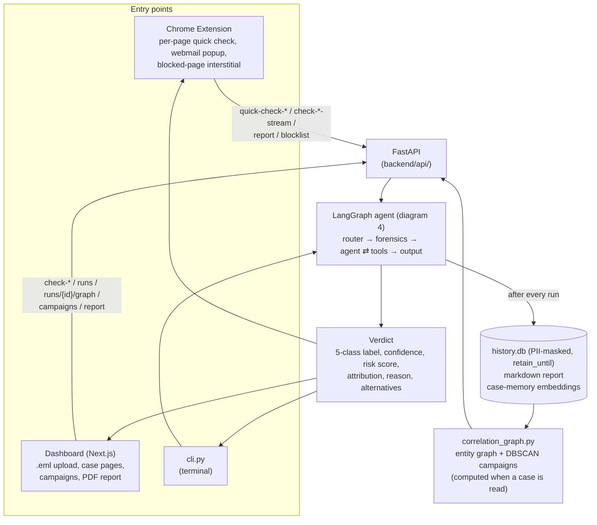
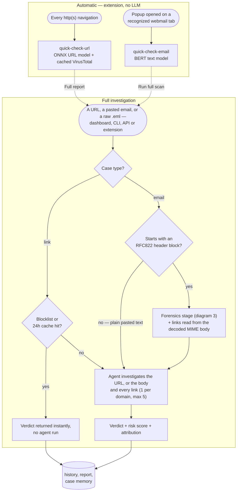
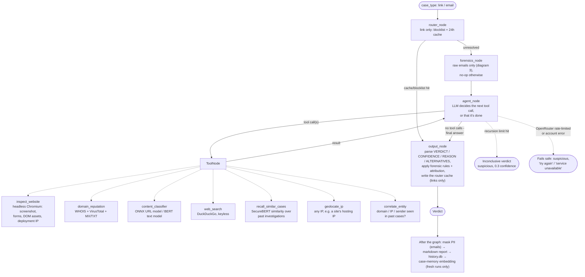

# Security-Copilot v2 — Email Forensic Intelligence

**Smart India Hackathon 2026 · Problem Statement SIH26106** — *AI-Powered Email Threat Detection, GeoLocation and
Forensic Intelligence Platform* (AICTE Cyber Security Cell · Theme: Blockchain & Cybersecurity).

Drop in a raw email (`.eml` or the full message with headers) and one [LangGraph](https://github.com/langchain-ai/langgraph)
agent works out:

- **whether it's malicious:** a verdict in the five SIH26106 classes (**legitimate / suspicious / impersonated /
  phishing / fraud-related**) with a 0–100 risk score and a plain-English reason
- **where it came from:** the Received trace path, the originating IP, geolocation, and VPN/TOR/hosting flags
- **whether the sender is real:** SPF, DKIM and DMARC with domain alignment
- **what's attached:** file type/macro/ClamAV checks, plus a sandboxed structural read of PDF attachments — extracted text and links, embedded JavaScript/auto-launch/embedded-file detection; files are never opened or executed
- **who is probably behind it:** a rule-based attribution category
- **what else it's connected to:** a graph of shared domains/IPs/senders across cases, and campaign clusters

Everything is available from a web dashboard (with a forensic PDF report), a Chrome extension, a REST API and a
terminal CLI. The v1 link/URL investigation (sandboxed browser, WHOIS, VirusTotal, brand-impersonation search)
is still there, and every link inside an email gets that same investigation.

## What it does

- **Header & protocol analysis.** The stdlib `email` parser extracts From, Return-Path, Reply-To and Message-ID,
  and walks the Received chain oldest-first to find the originating server ("hop-0"). Out-of-order hops, missing
  chains and sender mismatches (From ≠ Return-Path, Reply-To on another domain) are flagged.
- **Sender authentication.** SPF (the delivering IP evaluated against the record, via `checkdmarc`), DKIM
  (`dkimpy`) and DMARC with relaxed alignment. It reports both what the recipient's server recorded
  (`Authentication-Results`) and a live re-check. A DMARC or SPF hard-fail raises the risk score and can escalate
  the verdict.
- **Origin traceability.** MaxMind GeoLite2 (offline) or ip-api.com gives country/region/city/ISP/ASN. The IP is
  checked against the Tor Project exit list, X4BNet VPN and datacenter ranges, and AbuseIPDB. Sender-domain age
  and MX/TXT records add infrastructure context.
- **Attachment analysis.** SHA-256/MD5 hashes, magic-byte type versus the claimed extension (catches
  `invoice.pdf.exe`), Office macro detection (`oletools`), and a ClamAV scan when a daemon is running. Attachments
  are only ever held in memory.
- **Investigates links, not just wording.** Every link in the email (decoded from the MIME body, including real
  `<a href>` targets) gets a headless-browser sandbox visit, WHOIS/VirusTotal checks and a DOM/hosting
  fingerprint. If brand impersonation is suspected, a web search finds the real site.
- **Verdict + attribution.** The agent picks one of the five classes. `agent/verdict_rules.py` then applies plain
  if/else rules: every point of risk has a written reason, and attribution is one of `spoofed_domain`,
  `compromised_account`, `anonymized_infrastructure`, `direct_actor` or `unknown`.
- **Identity correlation & campaigns.** Domains, IPs and sender addresses from every case form a NetworkX graph
  ("seen together in a case"). Similar malicious cases are clustered with DBSCAN over SecureBERT case embeddings;
  a campaign is a shared cluster ID. The agent can query this mid-investigation (`correlate_entity`).
- **Dashboard & reporting.** Each case page shows the origin on a map, the trace path, auth results, attachment
  findings, attribution and a connections graph. There's a campaign table and a one-click forensic PDF.
- **Privacy & legal.** Microsoft Presidio masks PII in stored email bodies, while headers are kept as evidence.
  Cases are deleted after `RETENTION_DAYS`. Confirmed-bad domains are reported (blocklist + VirusTotal), never
  attacked back.
- **Two-tier and fail-safe.** The extension (and the Gmail auto-scanner) give an instant local read (ONNX URL
  model, BERT text model, VirusTotal corroboration, Jev as a second text-classification opinion) on every
  page and webmail message. The full agent runs on request. Every external lookup degrades independently, and an
  LLM outage fails safe to "suspicious", never "legitimate".

## Architecture

### 1. Complete architecture



### 2. Detection flow



### 3. Email forensics

Runs in `agent/forensics_node.py` before the agent, only for raw RFC822 emails. Each step degrades on its own —
a failed lookup is recorded as unavailable and the rest carry on.

```mermaid
flowchart LR
    EML(["Raw email (.eml)"]) --> HDR["analyze_email_headers<br/>Received chain, hop-0 origin,<br/>sender mismatches"]
    HDR --> AUTH["validate_email_auth<br/>SPF / DKIM / DMARC<br/>+ alignment"]
    AUTH --> REP["domain_reputation<br/>sender-domain WHOIS age,<br/>VirusTotal, MX/TXT<br/>(if a From: domain exists)"]
    REP --> GEO["geolocate_ip<br/>location, ISP/ASN, TOR / VPN /<br/>hosting, AbuseIPDB<br/>(if an origin IP was found)"]
    GEO --> ATT["scan_attachments<br/>hashes, real type, macros, ClamAV,<br/>PDF: text/links/JS sandboxed read"]
    ATT --> AGENT["agent_node<br/>reasons over findings<br/>+ decoded body + links"]
    AGENT --> RULES["output_node → verdict_rules.py<br/>risk score, escalation,<br/>attribution"]
    RULES --> OUT(["Verdict"])
```



### 4. LangGraph agent flow



Full breakdown of every backend file: [backend/README.md](backend/README.md).

## Quick start

Prerequisites: Python 3.11+, Node.js with npm, and [pnpm](https://pnpm.io) for the dashboard. On Windows, run
the scripts from **Git Bash**.

**1. Install** (one-time):

```bash
git clone git@github.com:code-YK/Security-Copilot-Sih26.git
cd Security-Copilot-Sih26
./download_everything.bash    # venv, Python deps, spaCy model, Chromium, warms the ML model cache,
                               # dashboard deps, extension build
```

**2. Add your key:** edit `backend/.env` and set `OPENROUTER_API_KEY` (see [API keys & data](#api-keys--data)).

**3. Run:**

```bash
./start_all.bash               # backend on :8010 + dashboard on :3000
```

Open **http://localhost:3000/**, go to **Email scans**, and upload a `.eml`. Try
`backend/tests/fixtures/phish_paypal.eml`: a spoofed PayPal message sent through a TOR exit node, with a lookalike
link and a disguised `.exe`. Or use the CLI:

```bash
source .venv/bin/activate && cd backend     # Windows Git Bash: source .venv/Scripts/activate
python cli.py email < tests/fixtures/phish_paypal.eml
python cli.py link https://example.com
```

### API keys & data

- `OPENROUTER_API_KEY`: **required**, the agent's LLM via OpenRouter. Get a key at https://openrouter.ai/keys.
  The default model is `openai/gpt-oss-120b`; change `OPENROUTER_MODEL` to any tool-calling model. A rate limit or
  account error fails safe to a low-confidence "suspicious" verdict instead of crashing.
- MaxMind GeoLite2: optional but recommended. Put `GeoLite2-City.mmdb` and `GeoLite2-ASN.mmdb` in
  `backend/data/intel/` (free account: https://www.maxmind.com/en/geolite2/signup). Without them, geolocation
  falls back to ip-api.com (keyless, 45 req/min).
- `ABUSEIPDB_API_KEY`: optional, an abuse score for the origin IP. Free tier (1,000/day): https://www.abuseipdb.com/register
- `VT_API_KEY`: optional, VirusTotal lookups and the "Report & block" action. Free: https://www.virustotal.com/gui/join-us
- ClamAV: optional. If a `clamd` daemon is listening on `127.0.0.1:3310`, attachments are signature-scanned.
- Threat-intel lists in `backend/data/intel/`: the X4BNet VPN/datacenter CIDR lists are vendored (refresh by
  hand, see each file's header). The Tor exit list is downloaded and cached automatically.
- Privacy: `PII_MASKING_ENABLED` (default on) and `RETENTION_DAYS` (default 90, `0` keeps cases forever).

### Manual setup (if you'd rather not run the scripts)

```bash
python3 -m venv .venv && source .venv/bin/activate   # venv lives at the repo root
pip install torch --index-url https://download.pytorch.org/whl/cpu   # or the cu128 index for a CUDA GPU
pip install -r backend/requirements.txt
python -m spacy download en_core_web_sm              # PII masking model
playwright install chromium
cd backend && cp .env.example .env                   # then fill in OPENROUTER_API_KEY
uvicorn api.app:app --reload --port 8010

# In another terminal, the dashboard:
cd dashboard && pnpm install
NEXT_PUBLIC_API_BASE_URL=http://localhost:8010 pnpm dev
```

### Startup scripts, at a glance

| Script | What it does |
|---|---|
| `download_everything.bash` | One-time setup: repo-root venv, Python deps, spaCy model, Chromium, ML model cache (phishing classifiers + SecureBERT), dashboard deps, extension build, ClamAV. Safe to re-run. |
| `start_all.bash` | Starts the backend + dashboard, and reports which optional forensics data (GeoLite2, ClamAV) it found. `WITH_TUNNELS=1 ./start_all.bash` also exposes both publicly (ngrok + `cloudflared`) for the Gmail integration — see [gmail-addon/](gmail-addon/README.md). Off by default. |

Both expect the venv at `.venv/` in the repo root (not inside `backend/`); `download_everything.bash` creates it.

### Tests

```bash
cd backend && python -m pytest     # offline — DNS, geolocation, WHOIS and the LLM are stubbed
```

## Dashboard

A Next.js app (`dashboard/`), separate from the backend.

- **Email scans:** paste a message or upload a `.eml`, then open the full forensic case page.
- **Case page:** verdict class, risk score, campaign badge, attribution and its reason, and every risk factor. It
  also shows SPF/DKIM/DMARC chips, the origin IP on a Leaflet map with TOR/VPN/hosting flags, the Received trace
  path with flagged hops, header anomalies, attachment findings, and a connections graph to past cases. For
  links, you also get the sandbox screenshot, forms, DOM/hosting signals and the VirusTotal breakdown.
- **Campaigns:** a table of clusters with member cases, shared domains/IPs/senders, and first/last seen.
- **PDF report:** one click, generated in the browser. It includes the verdict, confidence, SPF/DKIM/DMARC, the
  origin IP and location, VPN/TOR/hosting flags, attribution, the campaign ID and the full delivery path.

## Load the Chrome extension

1. Start the backend first (`./start_all.bash`).
2. `cd extension && npm install && npm run build` (already done by `download_everything.bash`).
3. Open `chrome://extensions`, enable **Developer mode**, click **Load unpacked**, and select `extension/dist/`.
4. Browse normally. Every `http(s)://` navigation gets an instant local check: a quiet toast if it looks fine, a
   persistent banner if not, with a **Full report** button.
5. On a recognized webmail tab (Gmail, Outlook web, Yahoo Mail, Proton Mail), the popup runs a quick read on the
   open email, with **Run full scan** for the full investigation.
6. On Gmail specifically, opening an actual message (not a mailbox list/search/settings view) triggers the same
   quick check automatically — no popup click needed — the instant the URL's fragment identifies a real message
   (e.g. `#inbox/<id>`). Fires **once per message, ever**: the result is cached, so reopening the same email later
   never re-checks or re-alerts. This needs Gmail's host permission, already declared in `manifest.json`.
7. **Report & block** adds a confirmed-bad domain to this tool's blocklist and reports it to VirusTotal.

If your backend isn't on `http://127.0.0.1:8010`, change it in the extension's Settings. More detail:
[extension/README.md](extension/README.md).

## Gmail integration

Two pieces, both Google Apps Script against your own Gmail account — see [gmail-addon/README.md](gmail-addon/README.md) for full setup:

- **Auto-scanner:** a background trigger checks new mail every minute and applies a big, bold colored `Dangerous` / `Suspicious` / `Safe` label matching the backend's actual verdict, via the same fast quick-check path the extension uses (ML + Jev + VirusTotal, no LLM).
- **Add-on:** a sidebar "Check Report" button on any open email. If that email's already been checked, jumps straight to the existing report; otherwise hands it off to the dashboard, which runs the full investigation and shows live progress there — nothing scans inside Gmail itself.

Both need the backend (and, for the Add-on, the dashboard) reachable publicly — Apps Script runs on Google's servers, not your machine. `WITH_TUNNELS=1 ./start_all.bash` handles that.

## API

| Endpoint | Purpose |
|---|---|
| `POST /check-email` · `/check-email-stream` | Investigate an email (raw `.eml` text triggers forensics); the stream variant sends live progress over SSE |
| `POST /check-links` · `/check-links-stream` | Investigate URLs |
| `POST /quick-check-url` | Instant local ML read + VirusTotal corroboration, no LLM |
| `POST /quick-check-email` | Instant read: links resolved first (ML+VT, same corroboration as quick-check-url), that verdict passed as context into Jev (a second text-classification opinion via OpenRouter), Jev authoritative for the text verdict when available |
| `GET /runs` · `/runs/{id}` | Case history and full detail (includes `campaign_id`) |
| `GET /runs/{id}/graph` · `/correlate?entity=` | Identity correlation graph |
| `GET /campaigns` | Campaign clusters |
| `POST /report` · `GET /blocklist` | Report & block |
| `POST` · `GET /email-drafts/{id}` | Short-lived handoff slot for raw email content — the Gmail add-on's "Check Report" button hands a large payload off this way rather than via a URL, the dashboard reads it back and auto-starts a scan |
| `POST /gmail-reports` · `GET /gmail-reports/{message_id}` · `GET /gmail-reports/by-run/{run_id}` | Durable Gmail-message ↔ run mapping, so the add-on can skip re-scanning an already-checked email and the dashboard can link back to the original message |

Interactive docs: `http://127.0.0.1:8010/docs` while the backend is running.

## Repository layout

```
backend/        FastAPI + LangGraph agent (agent/), investigation and email-forensics tools (tools/),
                case memory (memory/), privacy (utils/privacy.py), tests (tests/). See backend/README.md.
dashboard/      Next.js dashboard: email/link scans, case pages, campaigns, PDF export.
extension/      Chrome MV3 extension: per-navigation quick scan, webmail popup, in-page banner,
                blocked-page interstitial.
gmail-addon/    Google Apps Script: background auto-scanner + a Gmail sidebar Add-on. See gmail-addon/README.md.
Presentation/   The v2 (SIH26106) presentation deck — open security-copilot-v2-presentation.html in a browser.
download_everything.bash   One-time setup.
start_all.bash             Starts the backend + dashboard (port-safe: refuses to clobber a listening port).
                            WITH_TUNNELS=1 also exposes both publicly for the Gmail integration.
```

## Status

**Built and tested:**
- **Email forensics:** header analysis, SPF/DKIM/DMARC, geolocation with VPN/TOR/hosting correlation,
  attachment scanning, the 5-class verdict and attribution rules, the correlation graph and campaigns, and PII
  masking with retention.
  - These are covered by the offline test suite.
  - They were smoke-tested through the API and dashboard with live DNS/geolocation lookups and a stubbed LLM
    verdict.
- **Carried over from v1 and verified against live services:** the link investigation agent, the router
  fast path, the dashboard, and the Chrome extension.
- **Gmail integration:** the auto-scanner and Add-on (`gmail-addon/`) were built and verified live end-to-end
  against a real Gmail account and real phishing URLs — link scoring corroborated with VirusTotal the same
  way the extension's quick-check does, Jev added as a second text-classification opinion.

**Known limitations:**
- The origin is the last public hop we can see: a TOR exit, VPN or compromised relay ends the trail.
- The campaign clustering threshold (`CAMPAIGN_DBSCAN_EPS`) was tuned on only a handful of cases.
- There is no labelled email benchmark yet, so detection quality hasn't been quantified.
- The VPN/datacenter lists are refreshed manually.
- ClamAV needs a separately installed daemon.
- The Gmail integration needs the backend (and dashboard) exposed publicly (`WITH_TUNNELS=1`), and the
  dashboard's tunnel URL changes on every full restart unless you set up a paid/reserved tunnel — see
  gmail-addon/README.md.
- No auth on the API/dashboard, no chain-of-custody (hashing/signing) on exported reports, no dedicated
  business-email-compromise pattern detector — named gaps from an internal review against SIH26106's
  problem statement, not yet closed.

## License

Provided as-is for evaluation/demo purposes.
